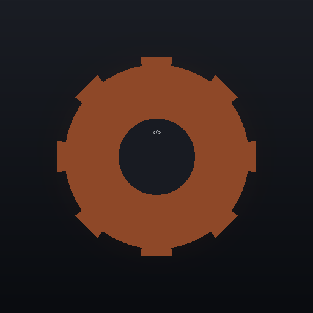

# Agents

Roster of AI agents I use in my daily life. 
It's better to manage context carefully, so I prefer having agents specialized in certain roles, rather than one jack of all trades with a bloated context window. 

| Agent | Face |
|---|---|
| **Hermes** — Router |  |
| **Mimir** — Teacher |  |
| **Horus** — Scout |  |
| **Builder** — Software Developer |  |
| **Venus** — Artist |  |

- **Hermes**: Router. Quick answers and to delegate work to agents better suit for it. It uses a cheap (0.05 USD/1M), smart-enough (+50 *Intelligence Index*), and low latency LLM (+160 tokens/s). 
- **Mimir**: Teacher. Provides explanations tailored to my own learning style. It uses a mid-priced (0.5 USD/1M) and smart (+55 *Intelligence Index*) LLM.
- **Horus**: Scout. Carries out strategic researches on the Internet and provides curated and source-cited reports. Multi-modal retrieval capabilities, latency tolerance, and +47 *Agentic Index*. 
- **Builder (Grok Build & Codex)**: Software developer. It encompasses Agent + Harness. It can be invoked via headless sessions or interactively. It needs to run in a coding-specialized harness and use an LLM with +60 *Coding Agent Index*.
- **Venus**: Graphic Designer. Image, video generation and edition. Artistic design. This role will have to choose several potential models depending on the task. 

***
The canonical configuration file is for [Hermes agent](https://hermes-agent.nousresearch.com/). 
I try to replicate similar configurations when possible if I use other harnesses. 
So, what matters is not the actual fields, but what I'm trying to achieve with them:

- Strategic Routing of Models
- Context Window Management
- Security Policies 

## Deployment

Each agent is a Hermes profile (see `skills_manifest.yaml` for the authoritative skill set per agent). The Router is the **default** profile (display name `hermes` — `hermes` itself is a reserved profile name). **Builder has no Hermes profile**: it is the Grok Build & Codex harnesses, listed in the manifest for reference only.

| Profile | Role | Model | Skills (bundled + custom) |
|---|---|---|---|
| default (`hermes`) | Hermes — Router | `deepseek/deepseek-v4-flash` | 17 bundled + `bootstrap-agent-roster` |
| `mimir` | Teacher | `deepseek/deepseek-v4-pro` | 11 bundled + `dictionary`, `teach`, `vocabulary` |
| `horus` | Scout | `google/gemini-3.7-flash` | 15 bundled |
| `venus` | Artist | `openai/gpt-5.6-luna` | 16 bundled |
| `builder` | Software Developer | external (Grok Build & Codex) | 9 bundled (manifest only, no profile) |

Notes:

- Avatars live at `~/.hermes/profiles/<name>/assets/avatar.png` (default: `~/.hermes/assets/avatar.png`); sources are in `media/`.
- `Builder`'s face (`media/builder.png`) is a generated placeholder — swap the file to replace it.
- New machines: run `skills/bootstrap-agent-roster/scripts/bootstrap_roster.py` to provision the whole roster (canonical config + hiding thinking + models + toolsets + skills + avatars).
